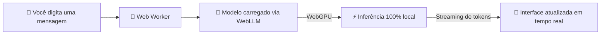

<div align="center">

# 🤖 ChatGPU

### Seu próprio ChatGPT, rodando 100% dentro do navegador

*Sem backend. Sem API paga. Sem seus dados saindo da sua máquina.*


**[🚀 Testar agora](https://chatgpu-nu.vercel.app/) · [🧠 Como funciona](#-como-funciona) · [🐛 Reportar bug](https://github.com/Victor-Gabriel-Barbosa/chatgpu/issues)**

</div>

---

## 📑 Sumário

- [Por que ChatGPU?](#-por-que-chatgpu)
- [Demo](#-demo)
- [Funcionalidades](#-funcionalidades)
- [Capturas de tela](#-capturas-de-tela)
- [Como funciona](#-como-funciona)
- [Modelos suportados](#-modelos-suportados)
- [Instalação](#-instalação)
- [Estrutura do projeto](#-estrutura-do-projeto)
- [Persistência](#-persistência)
- [Contribuição](#-contribuição)
- [FAQ](#-faq)
- [Licença](#-licença)

---

## 🎯 Por que ChatGPU?

A maioria dos chats de IA manda cada mensagem sua para um servidor de terceiros. O **ChatGPU** faz o oposto: ele baixa o modelo de linguagem uma vez e roda toda a inferência **dentro do seu navegador**, usando WebGPU para acelerar por hardware. Nada do que você digita sai da sua máquina.

| | 🤖 ChatGPU | ☁️ Chat na nuvem tradicional |
| --- | --- | --- |
| 🔒 Privacidade | Tudo roda localmente, nada é enviado | Mensagens trafegam por servidores externos |
| 💸 Custo | Gratuito, sem chave de API | Geralmente requer assinatura ou créditos |
| 🌐 Internet | Só é necessária para baixar o modelo | Necessária a cada mensagem enviada |
| ⚡ Processamento | Usa a GPU do seu próprio dispositivo | Depende da infraestrutura do provedor |

---

## 🚀 Demo

Experimente sem instalar nada:

**👉 https://chatgpu-nu.vercel.app/**

> ⚠️ Na primeira visita o navegador precisa baixar o modelo escolhido — isso pode levar alguns minutos, dependendo da sua conexão.

---

## ✨ Funcionalidades

- ⚡ **Execução local de LLMs** direto no navegador, acelerada por WebGPU
- 🧠 **Múltiplos modelos** disponíveis — Qwen, Llama, Phi, Gemma e outros
- 💬 **Interface moderna**, no estilo ChatGPT
- 🧾 **Histórico de conversas** salvo automaticamente no navegador
- 🧵 **Streaming em tempo real** das respostas, token a token
- ⏹️ **Interrupção da geração** a qualquer momento
- 📝 **Edição de mensagens** com regeneração de resposta
- 🎨 **Tema claro/escuro**
- 📱 **Layout responsivo**, funciona em desktop e mobile

---

## 📷 Capturas de tela

| Home | Chat |
| :---: | :---: |
|  |  |

| Modelos | Configurações |
| :---: | :---: |
|  |  |

---

## 🧠 Como funciona



O projeto utiliza o **`@mlc-ai/web-llm`**, que permite rodar modelos de linguagem diretamente no navegador combinando:

- **WebGPU** — acelera a inferência usando a GPU disponível
- **WebAssembly** — executa partes do runtime de forma otimizada
- **Web Workers** — mantém a UI fluida enquanto o modelo processa em segundo plano

Resumindo o fluxo: o modelo é carregado no browser → as mensagens vão para o worker → o modelo gera a resposta em streaming → a interface atualiza em tempo real.

---

## 🛠️ Stack tecnológica

| Tecnologia | Uso |
| --- | --- |
| Next.js (App Router) | Frontend / estrutura do app |
| React | Interface e gerenciamento de estado |
| TypeScript | Tipagem estática |
| Tailwind CSS | Estilização |
| shadcn/ui | Componentes de UI |
| WebLLM (MLC) | Execução dos modelos LLM no navegador |
| Web Workers | Processamento em background |
| Dexie.js | Persistência local (IndexedDB) |
| Tauri | Empacotamento como app desktop |

---

## 🧩 Modelos suportados

Os modelos são definidos em `/constants/models.ts`. Alguns exemplos disponíveis:

| Modelo | Origem | Bom para |
| --- | --- | --- |
| Qwen2.5 | Alibaba | Bom equilíbrio entre qualidade e desempenho |
| Llama 3 | Meta | Respostas de propósito geral com boa qualidade |
| Phi-3 | Microsoft | Modelo leve, ideal para hardware mais modesto |
| Gemma | Google | Alternativa compacta e rápida |

> ⚠️ Modelos maiores exigem mais RAM/VRAM e podem não rodar bem em todos os dispositivos — prefira os modelos menores em notebooks sem GPU dedicada.

---

## 📦 Instalação

**Pré-requisitos:**
- [Node.js](https://nodejs.org/) 18 ou superior
- Um navegador com suporte a **WebGPU** (Chrome, Edge ou outro navegador Chromium recente)

```bash
# Clone o repositório
git clone https://github.com/Victor-Gabriel-Barbosa/chatgpu.git

# Entre na pasta
cd chatgpu

# Instale as dependências
npm install

# Rode o projeto
npm run dev
```

Depois abra:

```
http://localhost:3000
```

---

## 📁 Estrutura do projeto

```
chatgpu/
├── app/                         # Next.js App Router
│   ├── layout.tsx               # Layout raiz da aplicação
│   ├── page.tsx                 # Página principal
│   └── globals.css              # Estilos globais
│
├── components/                  # Componentes React
│   ├── chat/                    # Componentes específicos do chat
│   │   ├── app-sidebar.tsx      # Sidebar da aplicação
│   │   ├── chat-message.tsx     # Componente de mensagem do chat
│   │   ├── code-block.tsx       # Bloco de código
│   │   ├── model-manager-modal.tsx  # Modal para gerenciar modelos
│   │   ├── service-worker-register.tsx  # Registro do service worker
│   │   └── settings-modal.tsx   # Modal de configurações
│   │
│   └── ui/                      # Componentes UI genéricos (Design System)
│       ├── avatar.tsx           # Avatar do usuário
│       ├── bubble.tsx           # Bubble de mensagem
│       ├── button.tsx           # Botão
│       ├── dialog.tsx           # Diálogo
│       ├── dropdown-menu.tsx    # Menu suspenso
│       ├── field.tsx            # Campo de formulário
│       ├── input.tsx            # Input
│       ├── label.tsx            # Label
│       ├── message-scroller.tsx # Scroll de mensagens
│       ├── message.tsx          # Componente de mensagem
│       ├── select.tsx           # Select
│       ├── separator.tsx        # Separador
│       ├── sheet.tsx            # Sheet (drawer)
│       ├── sidebar.tsx          # Sidebar genérica
│       ├── skeleton.tsx         # Skeleton loader
│       ├── sonner.tsx           # Toast notifications
│       ├── tabs.tsx             # Abas
│       ├── textarea.tsx         # Textarea
│       ├── theme-provider.tsx   # Provider de tema
│       └── tooltip.tsx          # Tooltip
│
├── hooks/                       # Custom React Hooks
│   ├── use-mobile.ts            # Hook para detectar mobile
│   ├── useEngine.ts             # Hook para gerenciar engine WebLLM
│   ├── useModelCache.ts         # Hook para cachear modelos
│   └── useSession.ts            # Hook para gerenciar sessão de chat
│
├── lib/                         # Utilitários e helpers
│   ├── fileToText.ts            # Converter arquivo para texto
│   ├── utils.ts                 # Funções utilitárias genéricas
│   └── worker.ts                # Web Worker
│
├── types/                       # Definições de tipos TypeScript
│   ├── chat.ts                  # Tipos relacionados ao chat
│   └── theme.ts                 # Tipos de tema
│
├── config/                      # Configurações
│   └── models.json              # Configuração de modelos disponíveis
│
├── db/                          # Banco de dados
│   └── database.ts              # Setup do banco de dados
│
├── public/                      # Arquivos estáticos
│   ├── apple-icon.png           # Ícone Apple
│   ├── favicon.ico              # Favicon
│   ├── icon0.svg                # Ícone SVG
│   ├── icon1.png                # Ícone PNG
│   ├── manifest.json            # Manifest PWA
│   └── sw.js                    # Service Worker
│
├── docs/                        # Documentação
├── screenshots/                 # Screenshots
├── src-tauri/                   # Código Tauri (versão desktop)
│
├── .gitignore
├── AGENTS.md
├── CLAUDE.md
├── README.md
├── components.json              # Config do componente UI library
├── eslint.config.mjs            # ESLint config
├── next.config.ts               # Next.js config
├── package.json                 # Dependências do projeto
├── package-lock.json
├── postcss.config.mjs            # PostCSS config
├── tsconfig.json                # TypeScript config
└── typedoc.json                 # TypeDoc config
```

---

## 💾 Persistência

Tudo fica salvo localmente, no seu próprio navegador:

| Chave | Descrição |
| --- | --- |
| `chatgpu-sessions` | Histórico de conversas |
| `chatgpu-model` | Modelo selecionado |
| `chatgpu-theme` | Tema (claro/escuro) |

---

## ⚠️ Limitações

- Depende de suporte a **WebGPU** (nem todos os navegadores suportam ainda)
- Pode consumir bastante memória, dependendo do modelo
- O carregamento inicial do modelo pode demorar
- A performance varia bastante conforme o hardware do usuário

---

## 🗺️ Roadmap

- [ ] Exportar/importar conversas
- [ ] Suporte a mais modelos
- [ ] Melhor gerenciamento de memória
- [ ] Deploy otimizado (lazy loading de modelos)
- [ ] Suporte a plugins/tools

---

## 🤝 Contribuição

Pull requests são muito bem-vindos — desde ajustes de UI até suporte a novos modelos.

1. Faça um fork do projeto
2. Crie uma branch (`feature/minha-feature`)
3. Commit suas mudanças
4. Abra um PR

---

## ❓ FAQ

**Preciso estar online para usar?**
Só na primeira vez, para baixar o modelo escolhido. Depois disso, o modelo fica em cache no navegador.

**Minhas conversas são enviadas para algum servidor?**
Não. Toda a inferência acontece localmente, no seu próprio navegador.

**Funciona em qualquer computador?**
Depende do suporte a WebGPU do navegador e do hardware disponível — dispositivos sem GPU dedicada tendem a ser mais lentos, especialmente com modelos maiores.

**Posso usar no celular?**
Em tese sim, desde que o navegador do dispositivo suporte WebGPU, mas a experiência varia bastante.

---

## 📄 Licença

Distribuído sob a licença **MIT**.

---

<div align="center">

## 👨‍💻 Autor

Feito com 🧠 e ☕ por **Victor Gabriel Barbosa**

[](https://github.com/Victor-Gabriel-Barbosa)

### ⭐ Curtiu o projeto?

Deixa uma estrela no repositório — ajuda bastante a dar visibilidade pro projeto! 🚀

[](https://star-history.com/#Victor-Gabriel-Barbosa/chatgpu&Date)

</div>
