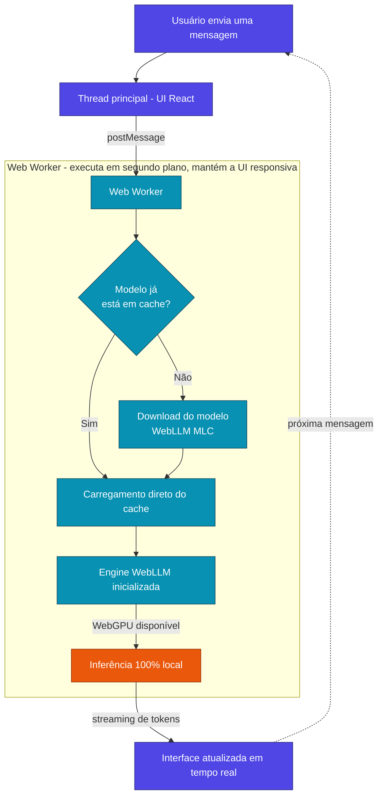

<div align="center">


# ChatGPU

**Seu próprio ChatGPT, rodando inteiramente no navegador**

Sem backend. Sem API paga. Sem seus dados saindo da sua máquina.


[](LICENSE)


<p align="center">
  <a href="https://chatgpu-nu.vercel.app/"></a>
  <a href="#download-do-aplicativo-desktop"></a>
  <a href="#como-funciona"></a>
  <a href="https://github.com/Victor-Gabriel-Barbosa/chatgpu/issues"></a>
</p>

</div>

---

## Sumário

- [Visão geral](#visão-geral)
- [Demonstração](#demonstração)
- [Documentação](https://victor-gabriel-barbosa.github.io/chatgpu/)
- [Download do aplicativo desktop](#download-do-aplicativo-desktop)
- [Funcionalidades](#funcionalidades)
- [Capturas de tela](#capturas-de-tela)
- [Como funciona](#como-funciona)
- [Stack tecnológica](#stack-tecnológica)
- [Modelos suportados](#modelos-suportados)
- [Instalação](#instalação)
- [Estrutura do projeto](#estrutura-do-projeto)
- [Persistência](#persistência)
- [Limitações](#limitações)
- [Roadmap](#roadmap)
- [Contribuição](#contribuição)
- [Perguntas frequentes](#perguntas-frequentes)
- [Licença](#licença)

---

## Visão geral

A maioria dos assistentes de IA baseados em chat envia cada mensagem para um servidor de terceiros para processamento. O **ChatGPU** inverte essa lógica: o modelo de linguagem é baixado uma única vez e toda a inferência é executada **dentro do próprio navegador**, com aceleração por hardware via WebGPU. Nenhuma informação digitada pelo usuário deixa o dispositivo.

| Critério | ChatGPU | Chat em nuvem tradicional |
| --- | --- | --- |
| Privacidade | Processamento local; nada é transmitido | Mensagens trafegam por servidores externos |
| Custo | Gratuito, sem chave de API | Geralmente requer assinatura ou créditos |
| Conectividade | Necessária apenas para baixar o modelo | Necessária a cada mensagem enviada |
| Processamento | Executado na GPU do próprio dispositivo | Depende da infraestrutura do provedor |

---

## Demonstração

Experimente sem necessidade de instalação:

**https://chatgpu-nu.vercel.app/**

> Na primeira visita, o navegador precisa baixar o modelo selecionado. Esse processo pode levar alguns minutos, dependendo da conexão.

---

## Download do aplicativo desktop

Para quem prefere um aplicativo nativo em vez do navegador, o ChatGPU também está disponível como aplicativo desktop, empacotado com **Tauri**, para Windows, macOS e Linux. Os binários estão disponíveis na [página de releases](https://github.com/Victor-Gabriel-Barbosa/chatgpu/releases/tag/v1.0.0) — versão atual: **v1.0.0**.

| Sistema operacional | Arquivo | Tamanho |
| --- | --- | --- |
| Windows — instalador | [`chatgpu_1.0.0_x64-setup.exe`](https://github.com/Victor-Gabriel-Barbosa/chatgpu/releases/download/v1.0.0/chatgpu_1.0.0_x64-setup.exe) | 9,46 MB |
| Windows — pacote MSI | [`chatgpu_1.0.0_x64_en-US.msi`](https://github.com/Victor-Gabriel-Barbosa/chatgpu/releases/download/v1.0.0/chatgpu_1.0.0_x64_en-US.msi) | 10,5 MB |
| macOS — Apple Silicon | [`chatgpu_1.0.0_aarch64.dmg`](https://github.com/Victor-Gabriel-Barbosa/chatgpu/releases/download/v1.0.0/chatgpu_1.0.0_aarch64.dmg) | 12,5 MB |
| Linux — Debian/Ubuntu (.deb) | [`chatgpu_1.0.0_amd64.deb`](https://github.com/Victor-Gabriel-Barbosa/chatgpu/releases/download/v1.0.0/chatgpu_1.0.0_amd64.deb) | 10,5 MB |
| Linux — Fedora/RHEL (.rpm) | [`chatgpu-1.0.0-1.x86_64.rpm`](https://github.com/Victor-Gabriel-Barbosa/chatgpu/releases/download/v1.0.0/chatgpu-1.0.0-1.x86_64.rpm) | 10,5 MB |
| Linux — universal (AppImage) | [`chatgpu_1.0.0_amd64.AppImage`](https://github.com/Victor-Gabriel-Barbosa/chatgpu/releases/download/v1.0.0/chatgpu_1.0.0_amd64.AppImage) | 84,4 MB |

> **macOS**: no momento há build apenas para **Apple Silicon (aarch64)**; ainda não existe `.dmg` para Macs com processador Intel.
>
> O código-fonte também pode ser baixado diretamente ([`.zip`](https://github.com/Victor-Gabriel-Barbosa/chatgpu/archive/refs/tags/v1.0.0.zip) / [`.tar.gz`](https://github.com/Victor-Gabriel-Barbosa/chatgpu/archive/refs/tags/v1.0.0.tar.gz)) para compilação manual com Tauri.

<details>
<summary>Checksums SHA-256</summary>

| Arquivo | SHA-256 |
| --- | --- |
| `chatgpu_1.0.0_x64-setup.exe` | `3e15222c9323b7a4656f37218ac3546e3a21889a46b0d90c2471e95dce47aa08` |
| `chatgpu_1.0.0_x64_en-US.msi` | `8ee06119c123ae4ec6ac7fc2dc09dee7fa51e2eb88eb565d580efa9b9691210b` |
| `chatgpu_1.0.0_aarch64.dmg` | `afaf555c2339795df88120d360db124d856ef9ed11154ec435b90ffdce98af4c` |
| `chatgpu_aarch64.app.tar.gz` | `650d4288e9b0263beca3f91f7cd9045cdc5e73a93166ada34ae887a30c3b1683` |
| `chatgpu_1.0.0_amd64.deb` | `d19bd23748f00281ff28fd0bda8e1222a1131aca457c5fac8433ca960134e3cd` |
| `chatgpu-1.0.0-1.x86_64.rpm` | `055bf4d290ebc0e669cf048fabe1f560e20b51ec8484c29004f8fa4deb5986d2` |
| `chatgpu_1.0.0_amd64.AppImage` | `a24841310c306b477a373c7bbf740d8ef35bd80669058318b51f1b84bcd946fe` |

Para verificar a integridade do download, utilize `sha256sum <arquivo>` (Linux/macOS) ou `Get-FileHash <arquivo> -Algorithm SHA256` (PowerShell).

</details>

---

## Funcionalidades

- Execução local de LLMs diretamente no navegador, com aceleração por WebGPU
- Suporte a múltiplos modelos, incluindo Qwen, Llama, Phi e Gemma
- Interface moderna, no padrão de assistentes conversacionais
- Histórico de conversas salvo automaticamente no navegador
- Streaming de respostas em tempo real, token a token
- Interrupção da geração a qualquer momento
- Edição de mensagens com regeneração de resposta
- Temas claro e escuro
- Layout responsivo, com suporte a desktop e dispositivos móveis

---

## Capturas de tela

| Início | Chat |
| :---: | :---: |
|  |  |
| Modelos | Configurações |
|  |  |

---

## Como funciona



O projeto utiliza a biblioteca **`@mlc-ai/web-llm`**, responsável por executar modelos de linguagem diretamente no navegador a partir da combinação de três componentes:

- **Web Workers** (`lib/worker.ts`) — a thread principal nunca é bloqueada: ela apenas envia a mensagem ao worker e recebe a resposta em streaming.
- **Cache do modelo** (`hooks/useModelCache.ts`) — no primeiro uso, o navegador baixa os pesos do modelo, o que pode levar alguns minutos; nas execuções seguintes, o carregamento é praticamente instantâneo.
- **WebGPU e WebAssembly** (`hooks/useEngine.ts`) — a inferência é acelerada por GPU quando disponível, com o WebAssembly responsável pelo runtime.

Em resumo, o fluxo de execução é: mensagem enviada → processamento pelo worker → download ou carregamento a partir do cache → inicialização da engine WebLLM → inferência local via WebGPU → tokens retornados em streaming para a thread principal, atualizando a interface em tempo real.

---

## Stack tecnológica

| Tecnologia | Finalidade |
| --- | --- |
| Next.js (App Router) | Estrutura e frontend da aplicação |
| React | Interface e gerenciamento de estado |
| TypeScript | Tipagem estática |
| Tailwind CSS | Estilização |
| shadcn/ui | Biblioteca de componentes de interface |
| WebLLM (MLC) | Execução de modelos LLM no navegador |
| Web Workers | Processamento em segundo plano |
| Dexie.js | Persistência local via IndexedDB |
| Tauri | Empacotamento como aplicativo desktop |

---

## Modelos suportados

Os modelos disponíveis são definidos em `/constants/models.ts`. Entre os exemplos suportados estão:

| Modelo | Origem | Indicado para |
| --- | --- | --- |
| Qwen2.5 | Alibaba | Bom equilíbrio entre qualidade e desempenho |
| Llama 3 | Meta | Respostas de propósito geral com boa qualidade |
| Phi-3 | Microsoft | Modelo leve, indicado para hardware mais modesto |
| Gemma | Google | Alternativa compacta e rápida |

> Modelos maiores exigem mais RAM e VRAM e podem apresentar desempenho reduzido em determinados dispositivos. Em notebooks sem GPU dedicada, recomenda-se priorizar modelos menores.

---

## Instalação

**Pré-requisitos**

- [Node.js](https://nodejs.org/) 18 ou superior
- Navegador com suporte a **WebGPU** (Chrome, Edge ou outro navegador baseado em Chromium recente)

**Passos**

```bash
# Clonar o repositório
git clone https://github.com/Victor-Gabriel-Barbosa/chatgpu.git

# Acessar o diretório do projeto
cd chatgpu

# Instalar as dependências
npm install

# Executar o projeto em modo de desenvolvimento
npm run dev
```

Em seguida, acesse:

```
http://localhost:3000
```

> Caso prefira não compilar o projeto, o [aplicativo desktop pronto](#download-do-aplicativo-desktop) está disponível para os principais sistemas operacionais.

---

## Estrutura do projeto

```
chatgpu/
├── app/                                Next.js App Router
│   ├── layout.tsx                      Layout raiz da aplicação
│   ├── page.tsx                        Página principal
│   └── globals.css                     Estilos globais
│
├── components/                         Componentes React
│   ├── chat/                           Componentes específicos do chat
│   │   ├── app-sidebar.tsx             Sidebar da aplicação
│   │   ├── chat-message.tsx            Componente de mensagem do chat
│   │   ├── code-block.tsx              Bloco de código
│   │   ├── model-manager-modal.tsx     Modal de gerenciamento de modelos
│   │   ├── service-worker-register.tsx Registro do service worker
│   │   └── settings-modal.tsx          Modal de configurações
│   │
│   └── ui/                             Componentes de UI genéricos (design system)
│       ├── avatar.tsx
│       ├── bubble.tsx
│       ├── button.tsx
│       ├── dialog.tsx
│       ├── dropdown-menu.tsx
│       ├── field.tsx
│       ├── input.tsx
│       ├── label.tsx
│       ├── message-scroller.tsx
│       ├── message.tsx
│       ├── select.tsx
│       ├── separator.tsx
│       ├── sheet.tsx
│       ├── sidebar.tsx
│       ├── skeleton.tsx
│       ├── sonner.tsx
│       ├── tabs.tsx
│       ├── textarea.tsx
│       ├── theme-provider.tsx
│       └── tooltip.tsx
│
├── hooks/                            Custom React Hooks
│   ├── use-mobile.ts                 Detecção de ambiente mobile
│   ├── useEngine.ts                  Gerenciamento da engine WebLLM
│   ├── useModelCache.ts              Cache de modelos
│   └── useSession.ts                 Gerenciamento de sessão de chat
│
├── lib/                               Utilitários e helpers
│   ├── fileToText.ts                 Conversão de arquivo para texto
│   ├── utils.ts                      Funções utilitárias genéricas
│   └── worker.ts                     Web Worker
│
├── types/                             Definições de tipos TypeScript
│   ├── chat.ts
│   └── theme.ts
│
├── config/                            Configurações
│   └── models.json                   Configuração de modelos disponíveis
│
├── db/                                 Banco de dados
│   └── database.ts                   Setup do banco de dados
│
├── public/                            Arquivos estáticos
│   ├── apple-icon.png
│   ├── favicon.ico
│   ├── icon0.svg
│   ├── icon1.png
│   ├── manifest.json                 Manifest PWA
│   └── sw.js                         Service Worker
│
├── docs/                              Documentação
├── screenshots/                       Capturas de tela
├── src-tauri/                         Código Tauri (versão desktop)
│
├── .gitignore
├── AGENTS.md
├── CLAUDE.md
├── README.md
├── components.json                    Configuração da biblioteca de componentes
├── eslint.config.mjs                  Configuração do ESLint
├── next.config.ts                     Configuração do Next.js
├── package.json                       Dependências do projeto
├── package-lock.json
├── postcss.config.mjs                 Configuração do PostCSS
├── tsconfig.json                      Configuração do TypeScript
└── typedoc.json                       Configuração do TypeDoc
```

---

## Persistência

Todos os dados são armazenados localmente, no próprio navegador do usuário:

| Chave | Descrição |
| --- | --- |
| `chatgpu-sessions` | Histórico de conversas |
| `chatgpu-model` | Modelo selecionado |
| `chatgpu-theme` | Tema (claro/escuro) |

---

## Limitações

- Depende de suporte a **WebGPU**, ainda não disponível em todos os navegadores
- Pode apresentar consumo elevado de memória, dependendo do modelo utilizado
- O carregamento inicial do modelo pode levar alguns minutos
- O desempenho varia significativamente conforme o hardware do usuário

---

## Roadmap

- [ ] Exportação e importação de conversas
- [ ] Suporte a modelos adicionais
- [ ] Melhor gerenciamento de memória
- [ ] Otimização de deploy (carregamento tardio de modelos)
- [ ] Suporte a plugins e ferramentas externas

---

## Contribuição

Contribuições são bem-vindas, desde ajustes de interface até suporte a novos modelos.

1. Faça um fork do projeto
2. Crie uma branch (`feature/minha-feature`)
3. Realize o commit das alterações
4. Abra um Pull Request

---

## Perguntas frequentes

**É necessário estar online para usar o ChatGPU?**
Apenas na primeira execução, para o download do modelo selecionado. Após esse processo, o modelo permanece em cache no navegador.

**As conversas são enviadas para algum servidor?**
Não. Toda a inferência é executada localmente, no próprio navegador do usuário.

**Funciona em qualquer computador?**
O funcionamento depende do suporte a WebGPU do navegador e do hardware disponível. Dispositivos sem GPU dedicada tendem a apresentar desempenho mais lento, especialmente com modelos maiores.

**É possível utilizar em dispositivos móveis?**
Em princípio, sim, desde que o navegador do dispositivo tenha suporte a WebGPU. No entanto, a experiência pode variar consideravelmente.

**É necessário instalar o aplicativo desktop, ou é possível usar diretamente pelo navegador?**
Ambas as opções utilizam o mesmo motor de execução (WebLLM). O aplicativo desktop oferece apenas conveniências adicionais, como um ícone na área de trabalho e independência de uma aba de navegador aberta. Para testar sem instalação, utilize o [link da demonstração](https://chatgpu-nu.vercel.app/).

---

## Licença

Distribuído sob a licença **MIT**. Consulte o arquivo [LICENSE](LICENSE) para mais detalhes.

---

<div align="center">

### Autor

Desenvolvido por **Victor Gabriel Barbosa**

[](https://github.com/Victor-Gabriel-Barbosa)

Se este projeto foi útil, considere deixar uma estrela no repositório.

</div>
