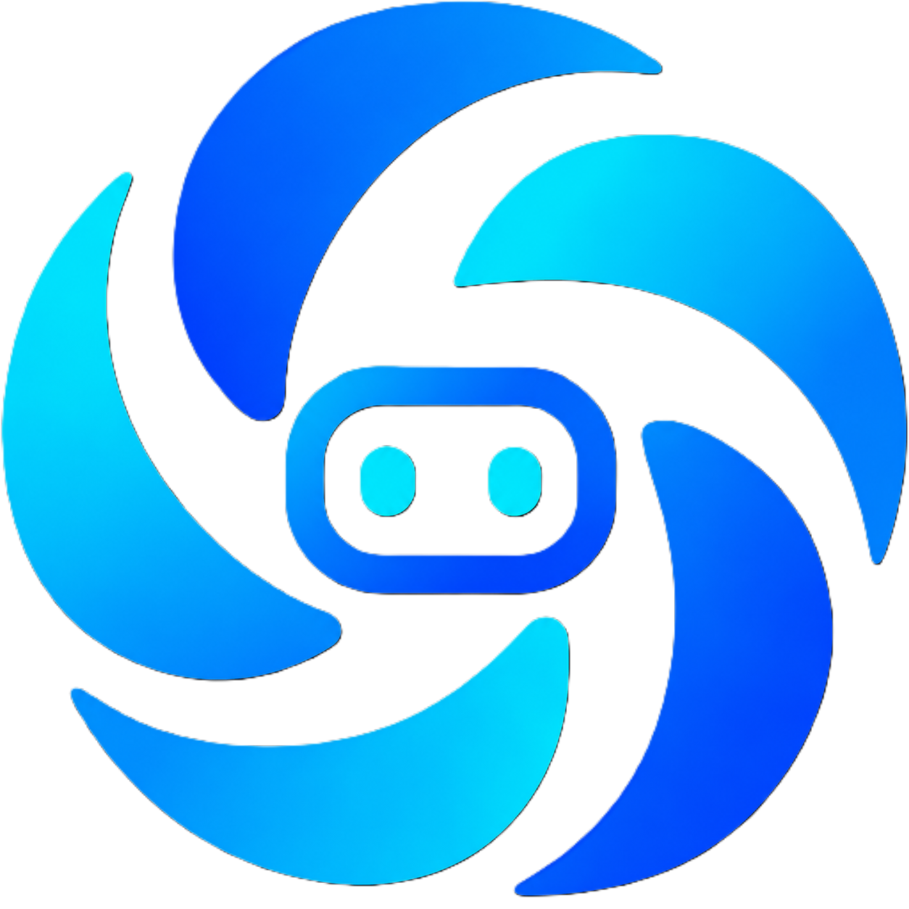
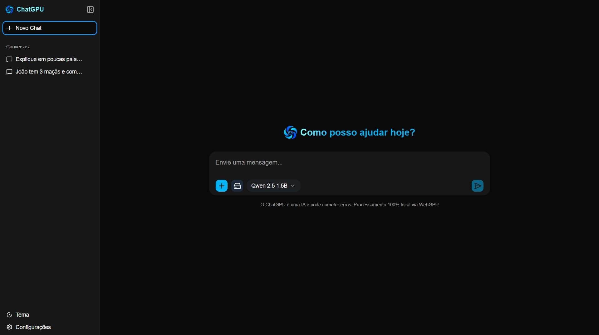
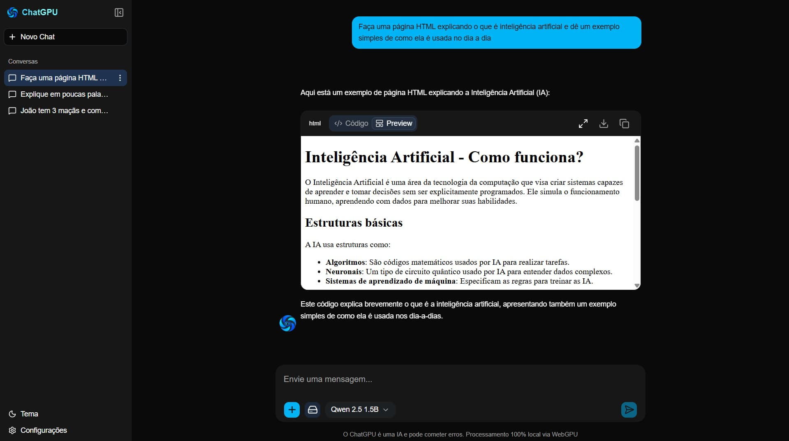
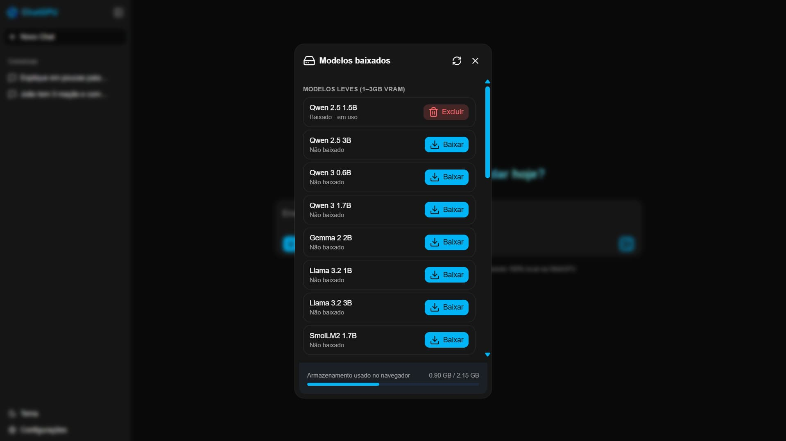
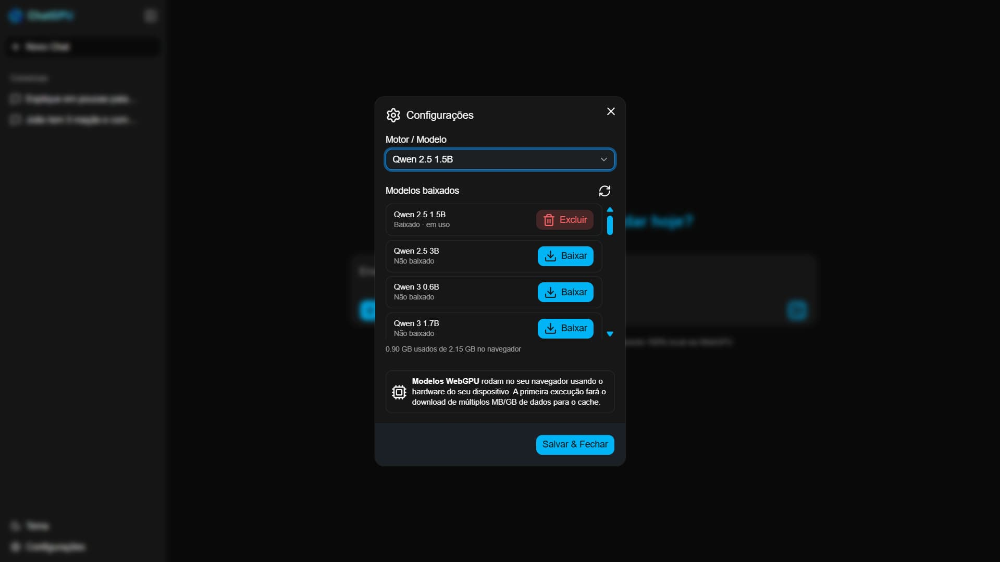
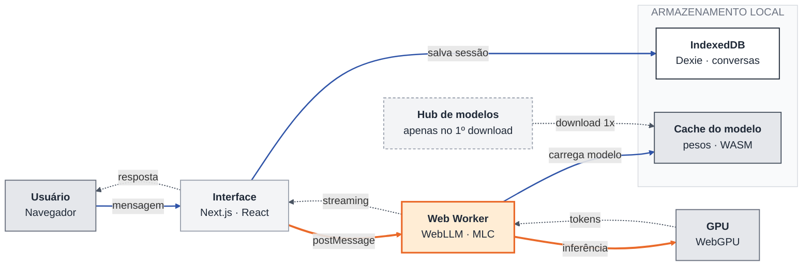
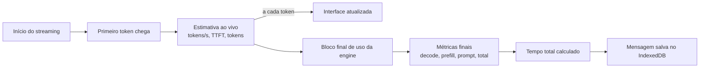

<div align="center">



# ChatGPU

**Seu próprio ChatGPT, rodando inteiramente no navegador**

Sem backend. Sem API paga. Sem seus dados saindo da sua máquina.


[](LICENSE)


<p align="center">
 <a href="https://chatgpu-nu.vercel.app/"></a>
 <a href="#como-funciona"></a>
 <a href="https://github.com/Victor-Gabriel-Barbosa/chatgpu/issues"></a>
</p>

</div>

---

## Sumário

- [Visão geral](#visão-geral)
- [Demonstração](#demonstração)
- [Documentação](https://victor-gabriel-barbosa.github.io/chatgpu/)
- [Funcionalidades](#funcionalidades)
- [Capturas de tela](#capturas-de-tela)
- [Como funciona](#como-funciona)
- [Métricas de desempenho](#métricas-de-desempenho)
- [Stack tecnológica](#stack-tecnológica)
- [Modelos suportados](#modelos-suportados)
- [Instalação](#instalação)
- [Estrutura do projeto](#estrutura-do-projeto)
- [Persistência](#persistência)
- [Limitações](#limitações)
- [Roadmap](#roadmap)
- [Contribuição](#contribuição)
- [Perguntas frequentes](#perguntas-frequentes)
- [Licença](#licença)

---

## Visão geral

A maioria dos assistentes de IA baseados em chat envia cada mensagem para um servidor de terceiros para processamento. O **ChatGPU** inverte essa lógica: o modelo de linguagem é baixado uma única vez e toda a inferência é executada **dentro do próprio navegador**, com aceleração por hardware via WebGPU. Nenhuma informação digitada pelo usuário deixa o dispositivo.

| Critério | ChatGPU | Chat em nuvem tradicional |
| --- | --- | --- |
| Privacidade | Processamento local; nada é transmitido | Mensagens trafegam por servidores externos |
| Custo | Gratuito, sem chave de API | Geralmente requer assinatura ou créditos |
| Conectividade | Necessária apenas para baixar o modelo | Necessária a cada mensagem enviada |
| Processamento | Executado na GPU do próprio dispositivo | Depende da infraestrutura do provedor |

---

## Demonstração

Experimente sem necessidade de instalação:

**https://chatgpu-nu.vercel.app/**

> Na primeira visita, o navegador precisa baixar o modelo selecionado. Esse processo pode levar alguns minutos, dependendo da conexão.

---

## Funcionalidades

- Execução local de LLMs diretamente no navegador, com aceleração por WebGPU
- Suporte a múltiplos modelos, incluindo Qwen, Llama, Phi e Gemma
- Interface moderna, no padrão de assistentes conversacionais
- Histórico de conversas salvo automaticamente no navegador
- Streaming de respostas em tempo real, token a token
- Métricas de desempenho por resposta: tokens por segundo, tempo até o primeiro token, uso de tokens e tempo total
- Interrupção da geração a qualquer momento
- Edição de mensagens com regeneração de resposta
- Temas claro e escuro
- Layout responsivo, com suporte a desktop e dispositivos móveis

---

## Capturas de tela

| Início | Chat |
| :---: | :---: |
|  |  |
| Modelos | Configurações |
|  |  |

---

## Como funciona


```mermaid
flowchart LR
    U["<b>Usuário</b><br/>Navegador"]:::ext
    UI["<b>Interface</b><br/>Next.js · React"]:::edge
    W["<b>Web Worker</b><br/>WebLLM · MLC"]:::focal
    GPU["<b>GPU</b><br/>WebGPU"]:::ext
    HUB["<b>Hub de modelos</b><br/>apenas no 1º download"]:::cloud

    subgraph LOCAL["ARMAZENAMENTO LOCAL"]
        direction TB
        DB["<b>IndexedDB</b><br/>Dexie · conversas"]:::bundle
        CACHE["<b>Cache do modelo</b><br/>pesos · WASM"]:::store
    end

    U -->|"mensagem"| UI
    UI ==>|"postMessage"| W
    W ==>|"inferência"| GPU
    GPU -.->|"tokens"| W
    W -.->|"streaming"| UI
    UI -.->|"resposta"| U
    UI -->|"salva sessão"| DB
    W -->|"carrega modelo"| CACHE
    HUB -.->|"download 1x"| CACHE

    classDef ext fill:#e5e7eb,stroke:#6b7280,stroke-width:1.5px,color:#1f2937
    classDef edge fill:#f3f4f6,stroke:#9ca3af,stroke-width:1.5px,color:#1f2937
    classDef focal fill:#ffedd5,stroke:#ea6a2a,stroke-width:2.5px,color:#1f2937
    classDef bundle fill:#ffffff,stroke:#1f2937,stroke-width:1.5px,color:#1f2937
    classDef store fill:#e5e7eb,stroke:#4b5563,stroke-width:1.5px,color:#1f2937
    classDef cloud fill:#f3f4f6,stroke:#9ca3af,stroke-width:1.5px,stroke-dasharray:4 3,color:#1f2937

    style LOCAL fill:#f9fafb,stroke:#d1d5db,color:#6b7280

    linkStyle 0,6,7 stroke:#2f54a8,stroke-width:2px
    linkStyle 1,2 stroke:#ea6a2a,stroke-width:3px
    linkStyle 3,4,5,8 stroke:#4b5563,stroke-width:1.5px
```

O projeto utiliza a biblioteca **`@mlc-ai/web-llm`**, responsável por executar modelos de linguagem diretamente no navegador a partir da combinação de três componentes:

- **Web Workers** (`lib/worker.ts`) - a thread principal nunca é bloqueada: ela apenas envia a mensagem ao worker e recebe a resposta em streaming.
- **Cache do modelo** (`hooks/useModelCache.ts`) - no primeiro uso, o navegador baixa os pesos do modelo, o que pode levar alguns minutos; nas execuções seguintes, o carregamento é praticamente instantâneo.
- **WebGPU e WebAssembly** (`hooks/useEngine.ts`) - a inferência é acelerada por GPU quando disponível, com o WebAssembly responsável pelo runtime.

Em resumo, o fluxo de execução é: mensagem enviada → processamento pelo worker → download ou carregamento a partir do cache → inicialização da engine WebLLM → inferência local via WebGPU → tokens retornados em streaming para a thread principal, atualizando a interface em tempo real.

---

## Métricas de desempenho

Cada resposta do assistente é acompanhada de métricas de geração, calculadas em tempo real no próprio navegador durante o streaming. A lógica está em [`lib/stream-assistant-reply.ts`](lib/stream-assistant-reply.ts), na função `streamAssistantReply`, e os valores ficam guardados no campo `metrics` de cada mensagem (tipo `MessageMetrics`, em `types/chat.ts`).

### Métricas coletadas

| Métrica | Campo | Unidade | Descrição |
| --- | --- | --- | --- |
| Velocidade de geração | `tokensPerSecond` | tokens/s | Velocidade de *decode*: quantos tokens o modelo produz por segundo |
| Tempo até o primeiro token | `timeToFirstToken` | s | Latência entre o início do streaming e a chegada do primeiro token da resposta |
| Velocidade de prefill | `prefillTokensPerSecond` | tokens/s | Velocidade de processamento do prompt (contexto) antes de a geração começar |
| Tokens da resposta | `completionTokens` | tokens | Quantidade de tokens gerados na resposta |
| Tokens do prompt | `promptTokens` | tokens | Quantidade de tokens enviados como contexto ao modelo |
| Total de tokens | `totalTokens` | tokens | Soma de tokens do prompt e da resposta |
| Tempo total | `elapsedTime` | s | Duração total da geração, do início do streaming até o último token |

### Como são calculadas

A coleta acontece em duas fases ao longo do streaming.

**1. Estimativa ao vivo (a cada token recebido)**

Enquanto os tokens chegam, as métricas são estimadas localmente para que a interface exiba a velocidade em tempo real:

- `timeToFirstToken` = instante de chegada do primeiro token - instante de início do streaming
- `tokensPerSecond` = `(tokens recebidos - 1) / tempo decorrido desde o primeiro token`. O primeiro token é descontado porque ele marca o início da contagem de tempo, e a estimativa só é calculada após cerca de 50 ms, evitando picos artificiais nos primeiros instantes
- `completionTokens` = contagem de trechos de texto recebidos (aproximação de 1 trecho ≈ 1 token)

A cada atualização, o callback opcional `onSpeedUpdate` é chamado com a velocidade atual, permitindo exibir o indicador de tokens por segundo enquanto a resposta é gerada.

**2. Valores finais (relatório de uso da engine)**

A requisição é feita com `stream_options: { include_usage: true }`. Ao fim do streaming, o WebLLM envia um último bloco com o relatório de uso, que substitui as estimativas por valores medidos pela própria engine:

- `tokensPerSecond` ← `decode_tokens_per_s` (mantém a estimativa ao vivo caso o valor não esteja disponível)
- `prefillTokensPerSecond` ← `prefill_tokens_per_s`
- `completionTokens`, `promptTokens` e `totalTokens` ← contagem oficial de tokens do modelo

Por fim, `elapsedTime` é calculado ao término da geração (caso ainda não tenha sido definido) e os valores são arredondados pela função auxiliar `round`, de `lib/utils.ts`.

### Fluxo de atualização


```mermaid
flowchart LR
 A[Início do streaming] --> B[Primeiro token chega]
 B --> C[Estimativa ao vivo<br/>tokens/s, TTFT, tokens]
 C -->|a cada token| D[Interface atualizada]
 C --> E[Bloco final de uso da engine]
 E --> F[Métricas finais<br/>decode, prefill, prompt, total]
 F --> G[Tempo total calculado]
 G --> H[Mensagem salva no IndexedDB]
```

Durante o streaming, as métricas ficam apenas no estado da interface. A persistência no IndexedDB (via Dexie, por meio de `updateChatMessages`) ocorre uma única vez, ao final da geração, com os valores definitivos - assim, as métricas de cada resposta continuam disponíveis ao reabrir uma conversa antiga.

### Como interpretar

- **Tokens por segundo (decode)** é o principal indicador de fluidez: quanto maior, mais rápido a resposta aparece na tela.
- **Tempo até o primeiro token** cresce com o tamanho do contexto, já que o modelo precisa processar todo o histórico antes de começar a responder. Conversas longas tendem a ter um valor maior.
- **Prefill** costuma ser bem mais rápido que o decode, pois o prompt é processado em paralelo na GPU.
- Os valores variam bastante conforme o **modelo**, a **GPU** e a **memória disponível**; compare sempre resultados obtidos no mesmo dispositivo.

> O tempo até o primeiro token e o tempo total são medidos a partir do início do consumo do stream no navegador e podem diferir ligeiramente de medições externas, como as de ferramentas de profiling.

---

## Stack tecnológica

| Tecnologia | Finalidade |
| --- | --- |
| Next.js (App Router) | Estrutura e frontend da aplicação |
| React | Interface e gerenciamento de estado |
| TypeScript | Tipagem estática |
| Tailwind CSS | Estilização |
| shadcn/ui | Biblioteca de componentes de interface |
| WebLLM (MLC) | Execução de modelos LLM no navegador |
| Web Workers | Processamento em segundo plano |
| Dexie.js | Persistência local via IndexedDB |

---

## Modelos suportados

Os modelos disponíveis são definidos em `/constants/models.ts`. Entre os exemplos suportados estão:

| Modelo | Origem | Indicado para |
| --- | --- | --- |
| Qwen2.5 | Alibaba | Bom equilíbrio entre qualidade e desempenho |
| Llama 3 | Meta | Respostas de propósito geral com boa qualidade |
| Phi-3 | Microsoft | Modelo leve, indicado para hardware mais modesto |
| Gemma | Google | Alternativa compacta e rápida |

> Modelos maiores exigem mais RAM e VRAM e podem apresentar desempenho reduzido em determinados dispositivos. Em notebooks sem GPU dedicada, recomenda-se priorizar modelos menores.

---

## Instalação

**Pré-requisitos**

- [Node.js](https://nodejs.org/) 18 ou superior
- Navegador com suporte a **WebGPU** (Chrome, Edge ou outro navegador baseado em Chromium recente)

**Passos**

```bash
# Clonar o repositório
git clone https://github.com/Victor-Gabriel-Barbosa/chatgpu.git

# Acessar o diretório do projeto
cd chatgpu

# Instalar as dependências
npm install

# Executar o projeto em modo de desenvolvimento
npm run dev
```

Em seguida, acesse:

```
http://localhost:3000
```

---

## Estrutura do projeto

```
├── .github/
│   └── workflows/
│       └── rust.yml
├── app/
│   ├── globals.css
│   ├── layout.tsx
│   └── page.tsx
├── components/
│   ├── ui/
│   │   ├── avatar.tsx
│   │   ├── bubble.tsx
│   │   ├── button.tsx
│   │   ├── dialog.tsx
│   │   ├── dropdown-menu.tsx
│   │   ├── field.tsx
│   │   ├── input.tsx
│   │   ├── label.tsx
│   │   ├── message-scroller.tsx
│   │   ├── message.tsx
│   │   ├── radio-group.tsx
│   │   ├── select.tsx
│   │   ├── separator.tsx
│   │   ├── sheet.tsx
│   │   ├── sidebar.tsx
│   │   ├── skeleton.tsx
│   │   ├── sonner.tsx
│   │   ├── tabs.tsx
│   │   ├── textarea.tsx
│   │   ├── theme-provider.tsx
│   │   └── tooltip.tsx
│   ├── app-sidebar.tsx
│   ├── chat-message.tsx
│   ├── code-block.tsx
│   ├── model-manager-modal.tsx
│   ├── service-worker-register.tsx
│   ├── settings-modal.tsx
│   └── startup-video.tsx
├── config/
│   ├── file-types.ts
│   └── models.json
├── db/
│   └── database.ts
├── docs/
│   ├── assets/
│   │   ├── hierarchy.js
│   │   ├── highlight.css
│   │   ├── icons.js
│   │   ├── icons.svg
│   │   ├── main.js
│   │   ├── navigation.js
│   │   ├── search.js
│   │   └── style.css
│   ├── functions/
│   │   ├── components_chat_model-manager-modal.ModelManagerModal.html
│   │   ├── components_chat_service-worker-register.ServiceWorkerRegister.html
│   │   ├── components_ui_avatar.Avatar.html
│   │   ├── components_ui_avatar.AvatarBadge.html
│   │   ├── components_ui_avatar.AvatarFallback.html
│   │   ├── components_ui_avatar.AvatarGroup.html
│   │   ├── components_ui_avatar.AvatarGroupCount.html
│   │   ├── components_ui_avatar.AvatarImage.html
│   │   ├── components_ui_bubble.Bubble.html
│   │   ├── components_ui_bubble.BubbleContent.html
│   │   ├── components_ui_bubble.BubbleGroup.html
│   │   ├── components_ui_bubble.BubbleReactions.html
│   │   ├── components_ui_button.Button.html
│   │   ├── components_ui_dialog.Dialog.html
│   │   ├── components_ui_dialog.DialogClose.html
│   │   ├── components_ui_dialog.DialogContent.html
│   │   ├── components_ui_dialog.DialogDescription.html
│   │   ├── components_ui_dialog.DialogFooter.html
│   │   ├── components_ui_dialog.DialogHeader.html
│   │   ├── components_ui_dialog.DialogOverlay.html
│   │   ├── components_ui_dialog.DialogPortal.html
│   │   ├── components_ui_dialog.DialogTitle.html
│   │   ├── components_ui_dialog.DialogTrigger.html
│   │   ├── components_ui_dropdown-menu.DropdownMenu.html
│   │   ├── components_ui_dropdown-menu.DropdownMenuCheckboxItem.html
│   │   ├── components_ui_dropdown-menu.DropdownMenuContent.html
│   │   ├── components_ui_dropdown-menu.DropdownMenuGroup.html
│   │   ├── components_ui_dropdown-menu.DropdownMenuItem.html
│   │   ├── components_ui_dropdown-menu.DropdownMenuLabel.html
│   │   ├── components_ui_dropdown-menu.DropdownMenuPortal.html
│   │   ├── components_ui_dropdown-menu.DropdownMenuRadioGroup.html
│   │   ├── components_ui_dropdown-menu.DropdownMenuRadioItem.html
│   │   ├── components_ui_dropdown-menu.DropdownMenuSeparator.html
│   │   ├── components_ui_dropdown-menu.DropdownMenuShortcut.html
│   │   ├── components_ui_dropdown-menu.DropdownMenuSub.html
│   │   ├── components_ui_dropdown-menu.DropdownMenuSubContent.html
│   │   ├── components_ui_dropdown-menu.DropdownMenuSubTrigger.html
│   │   ├── components_ui_dropdown-menu.DropdownMenuTrigger.html
│   │   ├── components_ui_field.Field.html
│   │   ├── components_ui_field.FieldContent.html
│   │   ├── components_ui_field.FieldDescription.html
│   │   ├── components_ui_field.FieldError.html
│   │   ├── components_ui_field.FieldGroup.html
│   │   ├── components_ui_field.FieldLabel.html
│   │   ├── components_ui_field.FieldLegend.html
│   │   ├── components_ui_field.FieldSeparator.html
│   │   ├── components_ui_field.FieldSet.html
│   │   ├── components_ui_field.FieldTitle.html
│   │   ├── components_ui_input.Input.html
│   │   ├── components_ui_label.Label.html
│   │   ├── components_ui_message-scroller.MessageScroller.html
│   │   ├── components_ui_message-scroller.MessageScrollerButton.html
│   │   ├── components_ui_message-scroller.MessageScrollerContent.html
│   │   ├── components_ui_message-scroller.MessageScrollerItem.html
│   │   ├── components_ui_message-scroller.MessageScrollerProvider.html
│   │   ├── components_ui_message-scroller.MessageScrollerViewport.html
│   │   ├── components_ui_message-scroller.useMessageScroller.html
│   │   ├── components_ui_message-scroller.useMessageScrollerScrollable.html
│   │   ├── components_ui_message-scroller.useMessageScrollerVisibility.html
│   │   ├── components_ui_message.Message.html
│   │   ├── components_ui_message.MessageAvatar.html
│   │   ├── components_ui_message.MessageContent.html
│   │   ├── components_ui_message.MessageFooter.html
│   │   ├── components_ui_message.MessageGroup.html
│   │   ├── components_ui_message.MessageHeader.html
│   │   ├── components_ui_select.Select.html
│   │   ├── components_ui_select.SelectContent.html
│   │   ├── components_ui_select.SelectGroup.html
│   │   ├── components_ui_select.SelectItem.html
│   │   ├── components_ui_select.SelectLabel.html
│   │   ├── components_ui_select.SelectScrollDownButton.html
│   │   ├── components_ui_select.SelectScrollUpButton.html
│   │   ├── components_ui_select.SelectSeparator.html
│   │   ├── components_ui_select.SelectTrigger.html
│   │   ├── components_ui_select.SelectValue.html
│   │   ├── components_ui_separator.Separator.html
│   │   ├── components_ui_sheet.Sheet.html
│   │   ├── components_ui_sheet.SheetClose.html
│   │   ├── components_ui_sheet.SheetContent.html
│   │   ├── components_ui_sheet.SheetDescription.html
│   │   ├── components_ui_sheet.SheetFooter.html
│   │   ├── components_ui_sheet.SheetHeader.html
│   │   ├── components_ui_sheet.SheetTitle.html
│   │   ├── components_ui_sheet.SheetTrigger.html
│   │   ├── components_ui_sidebar.Sidebar.html
│   │   ├── components_ui_sidebar.SidebarContent.html
│   │   ├── components_ui_sidebar.SidebarFooter.html
│   │   ├── components_ui_sidebar.SidebarGroup.html
│   │   ├── components_ui_sidebar.SidebarGroupAction.html
│   │   ├── components_ui_sidebar.SidebarGroupContent.html
│   │   ├── components_ui_sidebar.SidebarGroupLabel.html
│   │   ├── components_ui_sidebar.SidebarHeader.html
│   │   ├── components_ui_sidebar.SidebarInput.html
│   │   ├── components_ui_sidebar.SidebarInset.html
│   │   ├── components_ui_sidebar.SidebarMenu.html
│   │   ├── components_ui_sidebar.SidebarMenuAction.html
│   │   ├── components_ui_sidebar.SidebarMenuBadge.html
│   │   ├── components_ui_sidebar.SidebarMenuButton.html
│   │   ├── components_ui_sidebar.SidebarMenuItem.html
│   │   ├── components_ui_sidebar.SidebarMenuSkeleton.html
│   │   ├── components_ui_sidebar.SidebarMenuSub.html
│   │   ├── components_ui_sidebar.SidebarMenuSubButton.html
│   │   ├── components_ui_sidebar.SidebarMenuSubItem.html
│   │   ├── components_ui_sidebar.SidebarProvider.html
│   │   ├── components_ui_sidebar.SidebarRail.html
│   │   ├── components_ui_sidebar.SidebarSeparator.html
│   │   ├── components_ui_sidebar.SidebarTrigger.html
│   │   ├── components_ui_sidebar.useSidebar.html
│   │   ├── components_ui_skeleton.Skeleton.html
│   │   ├── components_ui_sonner.Toaster.html
│   │   ├── components_ui_tabs.Tabs.html
│   │   ├── components_ui_tabs.TabsContent.html
│   │   ├── components_ui_tabs.TabsList.html
│   │   ├── components_ui_tabs.TabsTrigger.html
│   │   ├── components_ui_textarea.Textarea.html
│   │   ├── components_ui_theme-provider.ThemeProvider.html
│   │   ├── components_ui_tooltip.Tooltip.html
│   │   ├── components_ui_tooltip.TooltipContent.html
│   │   ├── components_ui_tooltip.TooltipProvider.html
│   │   ├── components_ui_tooltip.TooltipTrigger.html
│   │   ├── hooks_use-engine.useEngine.html
│   │   ├── hooks_use-mobile.useIsMobile.html
│   │   ├── hooks_use-model-cache.useModelCache.html
│   │   ├── hooks_use-session.useSession.html
│   │   ├── lib_fileToText.fileToPlainText.html
│   │   ├── lib_fileToText.terminateOcrWorker.html
│   │   └── lib_utils.cn.html
│   ├── interfaces/
│   │   ├── components_chat_app-sidebar.AppSidebarProps.html
│   │   ├── components_chat_chat-message.ChatMessageProps.html
│   │   ├── components_chat_code-block.CodeBlockProps.html
│   │   ├── components_chat_settings-modal.SettingsModalProps.html
│   │   ├── components_chat_startup-video.StartupVideoProps.html
│   │   ├── hooks_use-model-cache.ManagedModel.html
│   │   ├── hooks_use-model-cache.StorageEstimateInfo.html
│   │   ├── hooks_use-session.UseSessionProps.html
│   │   ├── types_chat.Chat.html
│   │   ├── types_chat.ChatSession.html
│   │   └── types_chat.Message.html
│   ├── media/
│   │   ├── chatgpu_chat.jpg
│   │   ├── chatgpu_home.jpg
│   │   ├── chatgpu_models.jpg
│   │   └── chatgpu_settings.jpg
│   ├── modules/
│   │   ├── components_chat_app-sidebar.html
│   │   ├── components_chat_chat-message.html
│   │   ├── components_chat_code-block.html
│   │   ├── components_chat_model-manager-modal.html
│   │   ├── components_chat_service-worker-register.html
│   │   ├── components_chat_settings-modal.html
│   │   ├── components_chat_startup-video.html
│   │   ├── components_ui_avatar.html
│   │   ├── components_ui_bubble.html
│   │   ├── components_ui_button.html
│   │   ├── components_ui_dialog.html
│   │   ├── components_ui_dropdown-menu.html
│   │   ├── components_ui_field.html
│   │   ├── components_ui_input.html
│   │   ├── components_ui_label.html
│   │   ├── components_ui_message-scroller.html
│   │   ├── components_ui_message.html
│   │   ├── components_ui_select.html
│   │   ├── components_ui_separator.html
│   │   ├── components_ui_sheet.html
│   │   ├── components_ui_sidebar.html
│   │   ├── components_ui_skeleton.html
│   │   ├── components_ui_sonner.html
│   │   ├── components_ui_tabs.html
│   │   ├── components_ui_textarea.html
│   │   ├── components_ui_theme-provider.html
│   │   ├── components_ui_tooltip.html
│   │   ├── hooks_use-engine.html
│   │   ├── hooks_use-mobile.html
│   │   ├── hooks_use-model-cache.html
│   │   ├── hooks_use-session.html
│   │   ├── lib_fileToText.html
│   │   ├── lib_utils.html
│   │   ├── lib_worker.html
│   │   ├── types_chat.html
│   │   └── types_theme.html
│   ├── types/
│   │   └── types_theme.Theme.html
│   ├── variables/
│   │   ├── components_chat_app-sidebar.AppSidebar.html
│   │   ├── components_chat_chat-message.ChatMessage.html
│   │   ├── components_chat_code-block.CodeBlock.html
│   │   ├── components_chat_settings-modal.SettingsModal.html
│   │   ├── components_chat_startup-video.StartupVideo.html
│   │   ├── components_ui_button.buttonVariants.html
│   │   └── components_ui_tabs.tabsListVariants.html
│   ├── .nojekyll
│   ├── hierarchy.html
│   ├── index.html
│   └── modules.html
├── hooks/
│   ├── use-engine.ts
│   ├── use-mobile.ts
│   ├── use-model-cache.ts
│   └── use-session.ts
├── lib/
│   ├── fileToText.ts
│   ├── stream-assistant-reply.ts
│   ├── utils.ts
│   └── worker.ts
├── public/
│   ├── apple-icon.png
│   ├── chatgpu-video.mp4
│   ├── favicon.ico
│   ├── icon0.svg
│   ├── icon1.png
│   ├── manifest.json
│   └── sw.js
├── screenshots/
│   ├── chatgpu_chat.jpg
│   ├── chatgpu_home.jpg
│   ├── chatgpu_models.jpg
│   └── chatgpu_settings.jpg
├── types/
│   ├── chat.ts
│   ├── model.ts
│   └── theme.ts
├── .gitignore
├── AGENTS.md
├── CLAUDE.md
├── components.json
├── eslint.config.mjs
├── next.config.ts
├── package-lock.json
├── package.json
├── postcss.config.mjs
├── README.md
├── tsconfig.json
└── typedoc.json
```

---

## Persistência

Todos os dados são armazenados localmente, no próprio navegador do usuário:

| Chave | Descrição |
| --- | --- |
| `chatgpu-sessions` | Histórico de conversas (incluindo as métricas de cada resposta) |
| `chatgpu-model` | Modelo selecionado |
| `chatgpu-theme` | Tema (claro/escuro) |

---

## Limitações

- Depende de suporte a **WebGPU**, ainda não disponível em todos os navegadores
- Pode apresentar consumo elevado de memória, dependendo do modelo utilizado
- O carregamento inicial do modelo pode levar alguns minutos
- O desempenho varia significativamente conforme o hardware do usuário

---

## Roadmap

- [x] Exportação e importação de conversas
- [x] Suporte a modelos adicionais
- [x] Métricas de desempenho por resposta
- [x] Melhor gerenciamento de memória
- [x] Otimização de deploy (carregamento tardio de modelos)
- [ ] Suporte a plugins e ferramentas externas

---

## Contribuição

Contribuições são bem-vindas, desde ajustes de interface até suporte a novos modelos.

1. Faça um fork do projeto
2. Crie uma branch (`feature/minha-feature`)
3. Realize o commit das alterações
4. Abra um Pull Request

---

## Perguntas frequentes

**É necessário estar online para usar o ChatGPU?**
Apenas na primeira execução, para o download do modelo selecionado. Após esse processo, o modelo permanece em cache no navegador.

**As conversas são enviadas para algum servidor?**
Não. Toda a inferência é executada localmente, no próprio navegador do usuário.

**Funciona em qualquer computador?**
O funcionamento depende do suporte a WebGPU do navegador e do hardware disponível. Dispositivos sem GPU dedicada tendem a apresentar desempenho mais lento, especialmente com modelos maiores.

**É possível utilizar em dispositivos móveis?**
Em princípio, sim, desde que o navegador do dispositivo tenha suporte a WebGPU. No entanto, a experiência pode variar consideravelmente.

**O que significam as métricas exibidas em cada resposta?**
São indicadores de desempenho calculados localmente: velocidade de geração (tokens por segundo), tempo até o primeiro token, velocidade de prefill e contagem de tokens. Veja os detalhes em [Métricas de desempenho](#métricas-de-desempenho).

---

## Licença

Distribuído sob a licença **MIT**. Consulte o arquivo [LICENSE](LICENSE) para mais detalhes.

---

<div align="center">

### Autor

Desenvolvido por **Victor Gabriel Barbosa**

[](https://github.com/Victor-Gabriel-Barbosa)

Se este projeto foi útil, considere deixar uma estrela no repositório.

</div>
